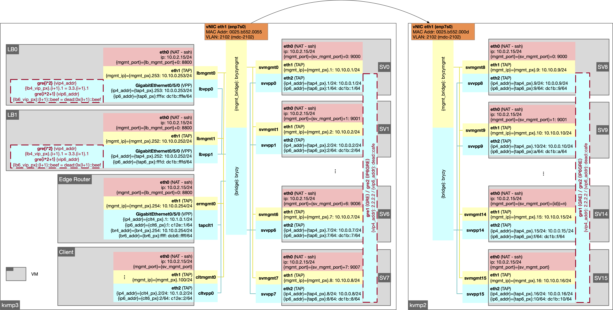
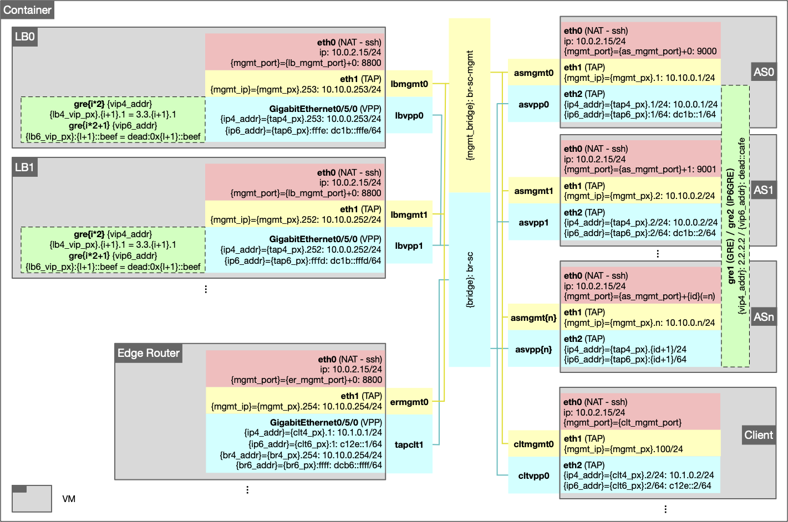
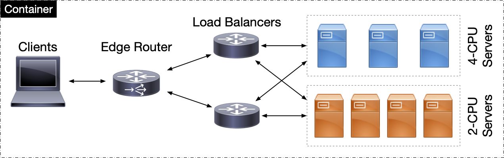

# MARLLB

> Multi-Agent Load Balancers in Data Centers

## Introduction

This repository implements a multi-agent reinforcement learning (MARL) load balancer as a plugin in VPP. 
For the sake of reproducibility, software and data artifacts for performance evaluation are maintained in this repository.

## Directory Roadmap

```
- config                    // configuration files in json format
- src                       // source code
    + client/server         // scripts that run on client/server VMs
    + lb                    // scripts that run on lb VMs
    + utils                 // utility scripts that help to run the testbed
    + vpp                   // vpp plugin
    + test                  // unit test codes
- data                      
    + trace                 // network traces replayed on the testbed
    + results (omitted)     // This is where all the datasets are dumped (will be automatically created once we run experiments)
    + img                   // VM image files (omitted here because of file size, server configurations are documented in README, can be pulled with Makefile)
```

## Workflow

To build and prepare the environment (takes about 0.5-1h):

```bash
$ sudo make build-origin
```

To run the container:

```bash
$ sudo make run
```

To get into the container:

```bash
$ sudo docker exec -it aquarius /bin/bash
```

To run a unit-test in the container:

```bash
root@aquarius:/opt/aquarius# make docker-run-unittest
```

To check the results and make some plots, check the jupyter notebook in a browser at `http://localhost:8888/notebooks/notebook/unittest/Micro-Benchmark.ipynb` (or do a port forwarding if necessary).

To cleanup the environment and close the container:

```bash
$ sudo make clean
```

## Notes

### Pre-Configuration

Before configuring the testbed and running all the experiments, there are several preamables that we would like to let you know: 
- The basic idea of this repo is to help you create a docker container in which you can run multiple KVMs emulating independent networking devices, which are bridged and -- as a whole -- represent a cluster in DC networks. 
- I know it is a little bit like "the inception" -- running KVMs in containers. But it takes time to configure all applications and input dataset, including Apache server, Wiki-Loader, SQL database (the replica of the Wikipedia English webpage database takes 22GB), _etc._. Therefore, I believe this would be the simplest approach for reproduction.
- To run all the experiments within the container, an ssh-key is created in the container host and the corresponding public key has been installed on the origin KVM image, so that commands can be executed from the container host using `ssh -t -t`.
- Make sure you have `qemu-utils` (which contains `qemu-nbd` and other sub-directories) installed on the host machine so that we can gain access to the `/dev/nbd0` to run KVM in the container.
- Running the container requires to share the `/dev` and `/sys` directory of the host machine since the qemu KVM relies on `nbd` to mount images and VPP relies on `/sys/bus/pci/drivers`.
- In general, it takes time to reproduce all the results from the paper. To give you a basic idea, a single run of a test could take up to 3 min. To generate one datapoint in _e.g._ Fig.20-(a), we need 10 runs of the same test. To reproduce Fig.20-(a), in total we will need 10 runs * 
4 methods * 11 tests (time of day) * 3 min = 22 hours.

### Unittest Setup

A simple example is created using a small network topology (1 client, 1 edge router, 1 load balancer, and 4 application servers) on a single machine.
This should be runnable on a physical server with more than **40** CPUs. 
Simply follow the jupyter notebook in `notebook/unittest`. 
Make sure the configurations are well adapted to your own host machine.
Otherwise, the configuration can be modified in `config/cluster/unittest.json`. 
To reduce the amount of CPUs required, change the number of `vcpu` of each node in the json file.

## Reproducibility

Please make sure that you are in the main branch, so that you get the up-to-date scripts.

To reproduce the results in Aquarius paper, the three notebooks that were used are presented in `notebook/reproduce-origin`.
To run these experiments, **4** physical machines with **12** physcial cores (**48** CPUs) each are required. 
VLAN should be configured across the actual inerfaces in use. 
An example of network topology is depicted below.



To simplify the artifact evaluation process, the authors adapt this repository so that small-scale experiments can run in a single container on a single physical machine (**e.g.** with a Xeon processor).
The network topology in a single container on a single machine is depicted below.



This topology is equivalent with the following abstracted representation.



### Containerised VM Image

A base VM image is built and will be installed with `make build` at `data/img/origin.img`.
Based on this `origin.img`, subsidiary images will be created based on different configurations by functions (_e.g._ `create_base_image()` in `src/utils/testbed_utils.py`).
For each setup, the base image is first built based on the original image, then one VM image is created for each network node (_e.g._ client, edge router, load balancer, server).
